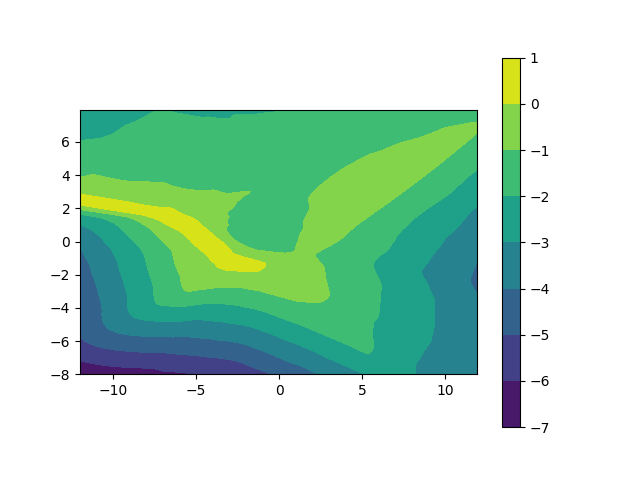

# simple-DVMPC-implemetation

This is an unofficial implementation of Deep Value Model Predictive Control (MPC) algorithm in the paper by F.Farshidian

## Algorithm
- Unlike the original paper, this implementation utilized the Cross Entropy Method (CEM) and Model Predictive Path Integral (MPPI) for MPC optimization.

## Environment
2d navigation environment
- The environment is a 2d world with walls and goal.
- the start point : (-10, 2)
- the end point : ( 0, -2)


## Usage
Train
- ensemble : if True, train the ensemble model
- seed : seed number (default: 1234)
- render : if True, visualize the agent on the environment
- the default parameters are defined in the `params/value_net.json` and `params/ensemble_value_net.json` file.
   
```
python3 examples/train_deep_value_mpc.py # train the single deep value mpc
```

```
python3 examples/train_deep_value_mpc.py --params_dir params/ensemble_value_net.json --ensemble # train the ensemble deep value mpc
```

Test
- the default load directory is defined in the `params/value_net.json` and `params/ensemble_value_net.json` file.

```
python3 examples/test_deep_value_mpc.py --params_dir params/value_net.json
```

Visualize
```
python3 examples/visualize_value_net.py
```
```
python3 examples/visualize_ensemble_value_net.py
```




## Reference
- [2D vehicle Env](https://github.com/MorvanZhou/Reinforcement-learning-with-tensorflow)
- Deep Value MPC : 
  - <https://arxiv.org/abs/1910.03358>
  - <https://arxiv.org/abs/2003.03200>
- ensemble method : 
  - based on [REDQ pytorch implementation](https://github.com/BY571/Randomized-Ensembled-Double-Q-learning-REDQ-)