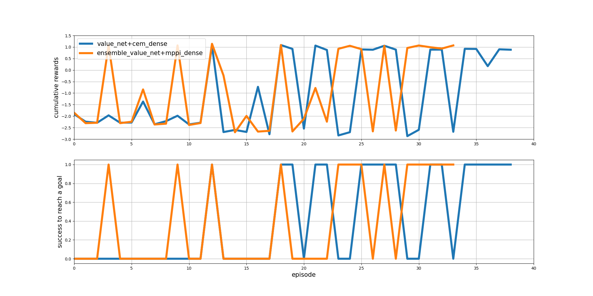

# simple-DVMPC-implemetation

The unofficial implementation of Deep Value Model Predictive Control (DVMPC) based on the papers by F.Farshidian and N.Karnchanachari

## Algorithm

- Unlike the original paper, this implementation utilized the Cross Entropy Method (CEM) and Model Predictive Path Integral (MPPI) for MPC optimization.

## Environment

2d navigation environment

- The environment is a 2d world with walls and goal.
- the start point : (-14, -10), (-14, 0), (-14, 10)
- the end point : (12, 0)


## Usage

Train

- ensemble : if True, train the ensemble model
- seed : seed number (default: 1234)
- render : if True, visualize the agent on the environment
- the default parameters are defined in the `params/value_net_cem` and `params/ensemble_net_mppi.json` file.

```bash
python3 examples/train_deep_value_mpc.py # train the single deep value mpc
```

```bash
python3 examples/train_deep_value_mpc.py --params_dir params/ensemble_net_mppi.json --ensemble # train the ensemble deep value mpc
```

Test

- the default load directory is defined in the `params/value_net_cem.json` or other files.

```bash
python3 examples/test_deep_value_mpc.py --params_dir params/value_net_cem.json
```

```bash
python3 examples/test_deep_value_mpc.py --params_dir params/ensemble_net_mppi.json --ensemble
```

Visualize

```bash
python3 postprocess/visualize_value_net.py --model_weights runs/value_net/mppi_dense/value_net_028
```

```bash
python3 postprocess/visualize_ensemble_value_net.py --model_weights runs/ensemble_value_net/mppi_dense/value_net_033
```

```bash
python3 postprocess/write_reward_plot.py --log_list runs/value_net/cem_dense/logs/20221030_222322.csv runs/ensemble_value_net/mppi_dense/logs/20221031_005341.csv
```


Reward plot



## Reference

- [2D vehicle Env](https://github.com/MorvanZhou/Reinforcement-learning-with-tensorflow)
- Deep Value MPC :  
  - <https://arxiv.org/abs/1910.03358>
  - <https://arxiv.org/abs/2003.03200>
- ensemble method :  
  - based on [REDQ pytorch implementation](https://github.com/BY571/Randomized-Ensembled-Double-Q-learning-REDQ-)
